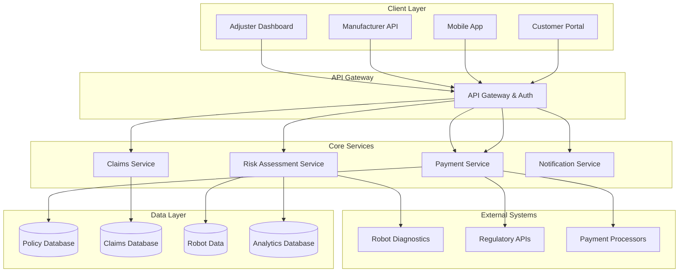

# Design Document

## Overview

The Humanoid Robot Insurance platform is a cloud-based SaaS solution that provides comprehensive insurance services specifically tailored for humanoid robots. The system integrates traditional insurance workflows with modern IoT capabilities and AI-driven risk assessment to create a specialized insurance marketplace.

The platform serves multiple stakeholders through different interfaces: a customer portal for robot owners, a manufacturer API for embedded insurance, an adjuster dashboard for claims processing, and analytics tools for risk management.

## Architecture

### High-Level Architecture



### Service Architecture

The system follows a microservices architecture with the following core services:

- **Policy Management Service**: Handles policy creation, modifications, renewals, and compliance
- **Claims Processing Service**: Manages claim submission, assessment, and settlement
- **Risk Assessment Service**: Analyzes robot data and calculates risk scores and premiums
- **Payment Service**: Processes payments, billing, and financial transactions
- **Notification Service**: Handles communications, alerts, and regulatory notifications
- **Robot Integration Service**: Manages connections to robot diagnostic systems

## Components and Interfaces

### Customer Portal Interface
- **Policy Dashboard**: View active policies, coverage details, and premium information
- **Quote Generator**: Input robot specifications and receive instant premium quotes
- **Claims Center**: Submit claims, upload documentation, track claim status
- **Payment Management**: Handle premium payments, view billing history
- **Robot Registration**: Register new robots and update specifications

### Manufacturer API
- **Policy Embedding API**: Integrate insurance options into robot sales process
- **Bulk Coverage API**: Manage fleet policies and volume pricing
- **Robot Registration API**: Automatically register robots upon sale
- **Diagnostic Integration API**: Connect robot telemetry to risk assessment

### Claims Processing Interface
- **Claim Intake System**: Collect incident reports, photos, and diagnostic data
- **Assessment Workflow**: Guide adjusters through evaluation process
- **Settlement Calculator**: Determine payout amounts based on policy terms
- **Communication Hub**: Manage adjuster-policyholder interactions

### Risk Assessment Engine
- **Robot Data Analyzer**: Process telemetry and diagnostic information
- **Actuarial Models**: Calculate premiums based on risk factors
- **Pattern Recognition**: Identify emerging risks and trends
- **Compliance Checker**: Ensure policies meet regulatory requirements

## Data Models

### Core Entities

```typescript
interface Robot {
  id: string;
  manufacturerId: string;
  model: string;
  serialNumber: string;
  specifications: RobotSpecs;
  owner: Customer;
  registrationDate: Date;
  lastDiagnostic: DiagnosticData;
}

interface Policy {
  id: string;
  policyNumber: string;
  robotId: string;
  customerId: string;
  coverageType: CoverageType;
  premiumAmount: number;
  deductible: number;
  effectiveDate: Date;
  expirationDate: Date;
  status: PolicyStatus;
  terms: PolicyTerms;
}

interface Claim {
  id: string;
  policyId: string;
  incidentDate: Date;
  reportedDate: Date;
  incidentType: IncidentType;
  description: string;
  estimatedDamage: number;
  status: ClaimStatus;
  adjusterNotes: string[];
  settlementAmount?: number;
}

interface RiskProfile {
  robotId: string;
  riskScore: number;
  riskFactors: RiskFactor[];
  lastAssessment: Date;
  premiumMultiplier: number;
  recommendedCoverage: CoverageRecommendation[];
}
```

### Coverage Types
- **Physical Damage**: Hardware repairs and replacement
- **Liability Coverage**: Third-party injury or property damage
- **Cyber Security**: Protection against hacking and data breaches
- **Business Interruption**: Lost productivity due to robot downtime
- **Product Recall**: Coverage for manufacturer defects

## Error Handling

### Error Categories
1. **Validation Errors**: Invalid input data, missing required fields
2. **Business Logic Errors**: Policy violations, coverage limitations
3. **Integration Errors**: Robot diagnostic failures, payment processing issues
4. **System Errors**: Database connectivity, service unavailability

### Error Response Strategy
- **Client Errors (4xx)**: Return detailed validation messages with corrective guidance
- **Server Errors (5xx)**: Log detailed error information, return generic user-friendly messages
- **Critical Failures**: Implement circuit breakers and fallback mechanisms
- **Audit Trail**: Maintain comprehensive logs for regulatory compliance

### Retry and Recovery
- **Idempotent Operations**: Ensure safe retry of policy and claim operations
- **Graceful Degradation**: Provide limited functionality when external services are unavailable
- **Data Consistency**: Implement eventual consistency patterns for distributed operations

## Testing Strategy

### Unit Testing
- **Service Logic**: Test business rules, calculations, and validations
- **Data Models**: Verify entity relationships and constraints
- **API Endpoints**: Test request/response handling and error conditions
- **Coverage Target**: 90% code coverage for core business logic

### Integration Testing
- **Database Operations**: Test data persistence and retrieval
- **External APIs**: Mock robot diagnostic and payment services
- **Service Communication**: Verify inter-service messaging and data flow
- **Authentication**: Test security and authorization workflows

### End-to-End Testing
- **User Journeys**: Complete policy purchase and claims workflows
- **Manufacturer Integration**: Test API embedding and bulk operations
- **Claims Processing**: Full adjuster workflow from submission to settlement
- **Regulatory Compliance**: Verify policy terms meet legal requirements

### Performance Testing
- **Load Testing**: Simulate high-volume policy creation and claims processing
- **Stress Testing**: Test system behavior under extreme load conditions
- **Scalability Testing**: Verify horizontal scaling capabilities
- **Response Time**: Ensure sub-second response for critical operations

### Security Testing
- **Authentication**: Test login, session management, and access controls
- **Data Protection**: Verify encryption of sensitive insurance and robot data
- **API Security**: Test rate limiting, input validation, and injection attacks
- **Compliance**: Ensure GDPR, CCPA, and insurance regulation compliance